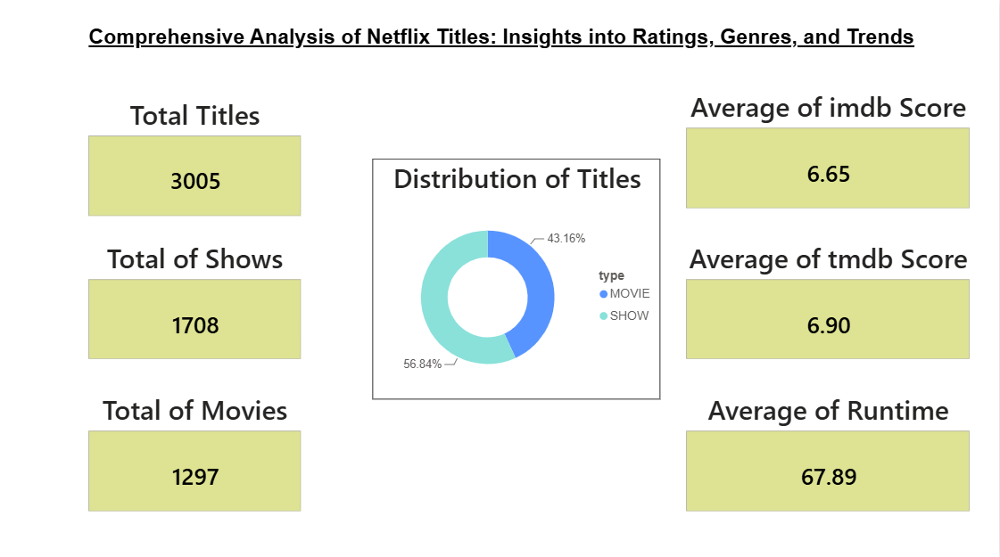
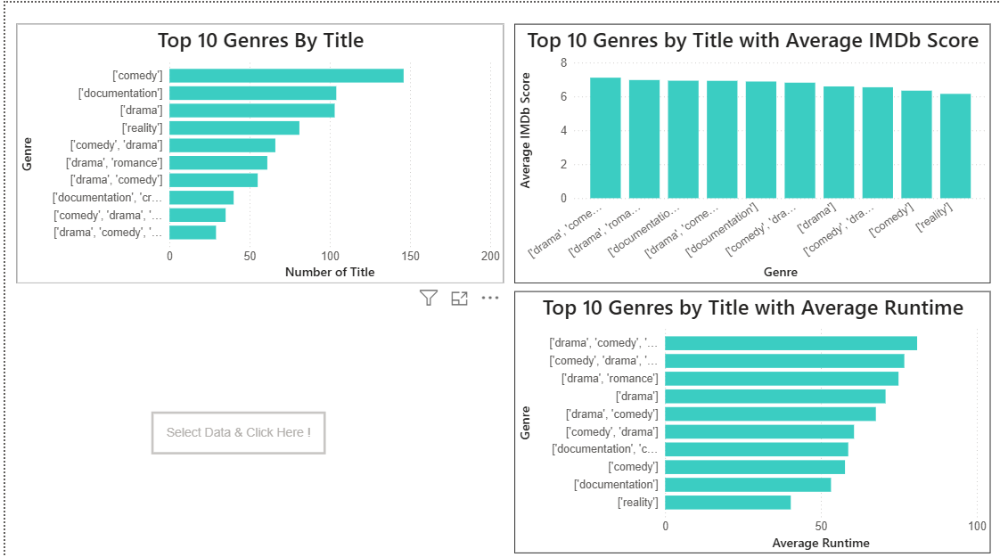
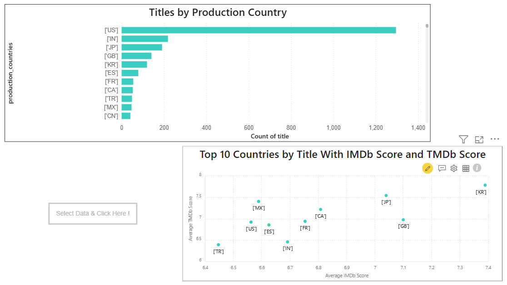
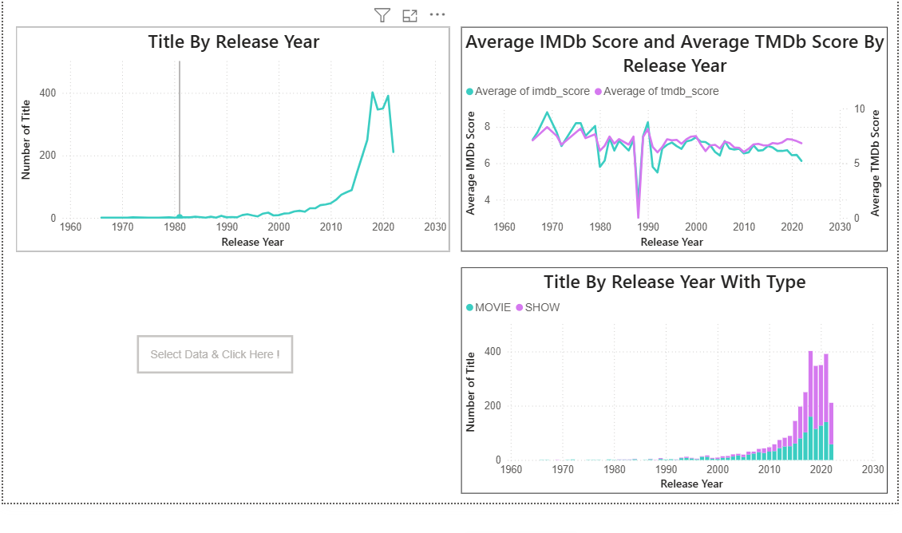
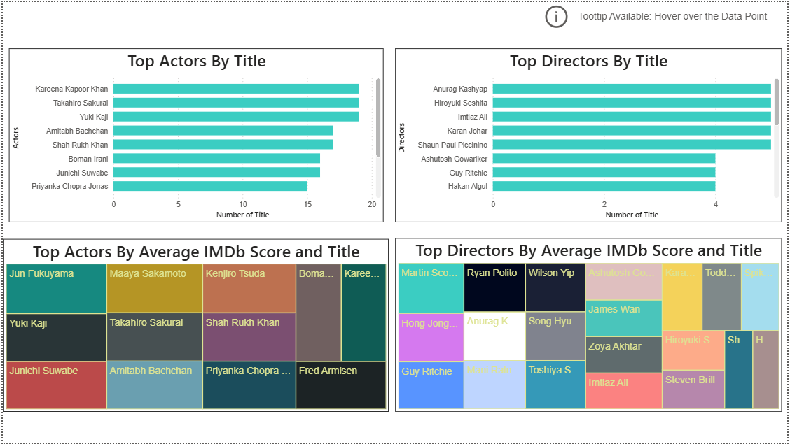
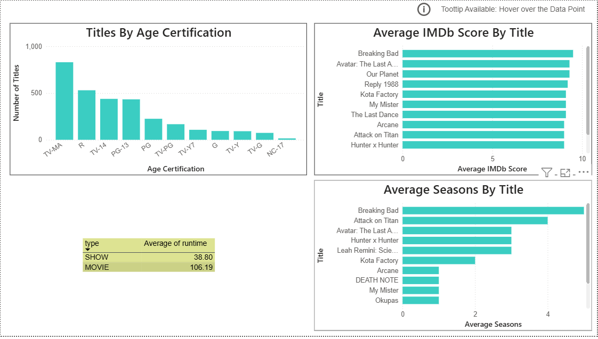
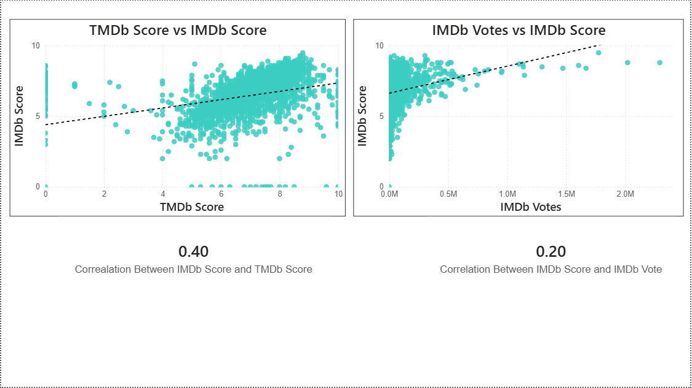

# 📺 Netflix Content Performance Analytics

## SQL | PostgreSQL | Power BI | DAX



## 📌 Project Overview

Streaming platforms manage large and diverse content catalogues spanning different genres, countries, release periods, audience classifications, and content formats.

However, catalogue size alone does not explain how content is distributed, which segments perform strongly, or whether popularity and ratings move together.

This project analyses **3,005 Netflix titles** using **PostgreSQL, SQL, Power BI, and DAX** to examine content composition, genre performance, geographic distribution, release trends, contributor patterns, and rating relationships.

The analysis was developed into a **7-page interactive Power BI dashboard**, transforming raw titles and credits data into insights that can support content portfolio analysis and strategic decision-making.

---

# 🎯 Business Problem

A streaming platform with thousands of titles needs to understand more than simply how much content it offers.

Decision-makers need visibility into:

- Which content types and genres dominate the catalogue?
- Which genres combine strong representation with stronger ratings?
- Which production countries contribute the most content, and how does rating performance vary geographically?
- How has the catalogue evolved across release years?
- Which actors and directors appear most frequently, and are they associated with stronger-rated content?
- How do movies and shows differ in runtime and catalogue composition?
- Do IMDb and TMDb ratings provide similar signals about content quality?
- Does greater audience attention, measured through IMDb votes, correspond with higher ratings?

Without structured analysis, these patterns remain hidden across thousands of individual title and credit records.

---

# ❓ Business Questions

The project was designed to answer seven core analytical questions.

### 1. What is the overall composition of the Netflix catalogue?

Analyse the balance between movies and shows and establish baseline KPIs for catalogue size, ratings, and runtime.

### 2. Which genres dominate the catalogue, and how do they perform?

Compare genre representation with average IMDb ratings and runtime to determine whether the most common genres are also the strongest-rated.

### 3. How is content distributed geographically?

Identify the largest production markets and compare IMDb and TMDb rating performance across countries.

### 4. How has the content catalogue evolved over time?

Analyse release-year trends to understand changes in content volume, movie/show composition, and average ratings.

### 5. Which actors and directors are most prominent?

Compare contributor frequency with the average IMDb performance of associated titles.

### 6. What patterns exist at title and certification level?

Examine age certification, runtime, seasons, and the highest-rated titles.

### 7. How strongly are ratings and popularity metrics related?

Measure the relationship between:

- IMDb Score and TMDb Score
- IMDb Votes and IMDb Score

to determine whether different rating and popularity indicators provide similar signals.

---

# 💡 Analytical Solution

An end-to-end analytical workflow was developed using **PostgreSQL, SQL, Power BI, and DAX**.

The solution involved:

1. Structuring and querying Netflix titles and credits data in PostgreSQL.
2. Connecting title-level and contributor-level information using common title identifiers.
3. Performing exploratory analysis using SQL.
4. Applying **joins, CTEs, aggregations, ranking, and window functions** to investigate content performance.
5. Developing analytical measures and KPIs in Power BI using DAX.
6. Building a **7-page interactive dashboard** covering content, genres, geography, time trends, contributors, titles, and rating relationships.
7. Translating the results into strategic insights and content portfolio recommendations.

---

# 🛠️ Tools & Technologies

| Technology | Application |
|---|---|
| **PostgreSQL** | Database management and analytical querying |
| **SQL** | EDA, joins, CTEs, aggregations, window functions, ranking and trend analysis |
| **Power BI** | Interactive dashboard development and data visualisation |
| **DAX** | KPI calculations and analytical measures |
| **Power Query** | Data preparation and transformation |

---

# 📂 Dataset

The project uses two primary datasets.

### `titles.csv`

Contains title-level information including:

- Title ID and name
- Movie or show classification
- Release year
- Age certification
- Runtime
- Genres
- Production countries
- Number of seasons
- IMDb score
- IMDb votes
- TMDb score
- TMDb popularity

### `credits.csv`

Contains contributor-level information including:

- Title ID
- Actor and director names
- Character information
- Contributor roles

The datasets were connected through the common **title ID**, allowing contributor information to be analysed alongside title-level performance.

---

# 🔄 Project Workflow

```text
Netflix Titles + Credits Data
            ↓
     Data Preparation
            ↓
       PostgreSQL
            ↓
   SQL Analysis & EDA
            ↓
Titles + Credits Integration
            ↓
   Power BI Data Model
            ↓
       DAX Measures
            ↓
7-Page Interactive Dashboard
            ↓
Business Insights & Recommendations
```

---

# 💻 SQL Analysis

SQL formed the analytical foundation of the project.

Techniques used included:

- **JOINs** to integrate titles and contributor data
- **Common Table Expressions (CTEs)** for multi-step analysis
- **Window functions** for ranking and comparative analysis
- **Aggregations** for genre, country, contributor, and time-based analysis
- **GROUP BY and filtering** for segmentation and performance comparisons
- **Ranking functions** to identify leading titles, actors, and directors

Key analyses included:

- Highest-rated titles
- Movie vs show analysis
- Genre distribution and ratings
- Release-year trends
- Actor and director frequency
- Contributor rating performance
- Runtime analysis
- Season analysis
- IMDb and TMDb rating relationships

---

# 📊 Dashboard & Analysis

## 1️⃣ Executive Content Overview

### Business Question

**What is the overall composition and baseline performance of the Netflix catalogue?**


### Analysis

The overview establishes the scale and structure of the analysed dataset.

**Key KPIs:**

- **3,005 Total Titles**
- **1,708 Shows**
- **1,297 Movies**
- **6.65 Average IMDb Score**
- **6.90 Average TMDb Score**
- **67.89 Average Runtime**

Shows account for approximately **56.84%** of titles, compared with **43.16% for movies**.

### Insight

The analysed catalogue is weighted toward episodic content, with shows representing the majority of available titles.

The average IMDb and TMDb scores are relatively close at an aggregate level, although later analysis shows that individual title ratings do not always align closely.

### Strategic Implication

Content portfolio decisions should evaluate **movies and shows separately**, rather than treating the catalogue as a single homogeneous portfolio, because the two formats differ substantially in structure, runtime, and representation.

---

## 2️⃣ Genre Performance Analysis

### Business Question

**Which genres dominate the catalogue, and are the most common genres also the strongest-performing?**



### Analysis

Genre performance was evaluated across three dimensions:

- Number of titles
- Average IMDb score
- Average runtime

Comedy, documentary, drama, and combinations of these categories appear prominently within the catalogue.

### Insight

High catalogue representation does **not automatically correspond with higher average IMDb ratings**.

Some heavily represented genre groups achieve moderate ratings, while less common combinations can perform more strongly.

Runtime also varies considerably across genre combinations.

### Strategic Solution

Content portfolio decisions should combine:

**Demand/representation + rating performance + content format**

rather than relying solely on the number of titles within a genre.

High-performing but underrepresented genres may represent opportunities for targeted content acquisition or development, while heavily represented but weaker-performing categories may warrant closer portfolio review.

---

## 3️⃣ Geographic Content Analysis

### Business Question

**Which countries contribute the most content, and does higher production volume correspond with stronger ratings?**



### Analysis

The dashboard compares:

- Number of titles by production country
- Average IMDb scores
- Average TMDb scores
- Cross-country rating performance

The **United States contributes by far the largest number of titles**.

Other significant production markets include:

- India
- Japan
- United Kingdom
- South Korea
- Spain
- France
- Canada

### Insight

The largest content-producing markets do not necessarily achieve the highest average ratings.

For example, several countries with substantially smaller catalogues show competitive or stronger average IMDb and TMDb scores.

### Strategic Solution

Content strategy should avoid using catalogue volume alone as a measure of market value.

A stronger approach would evaluate markets using both:

- **Content supply**
- **Average rating performance**

Smaller markets with strong rating performance may justify deeper investigation for international acquisition, licensing, or localisation opportunities.

---

## 4️⃣ Release Year Trend Analysis

### Business Question

**How has the catalogue evolved over time, and has rapid content growth affected average ratings?**



### Analysis

The dashboard tracks:

- Number of titles by release year
- Movie vs show distribution
- Average IMDb score
- Average TMDb score

Content volume increased sharply during the **2010s**, with the catalogue heavily concentrated around relatively recent releases.

Both movies and shows contributed to this expansion.

### Insight

Despite substantial growth in title volume, average IMDb and TMDb ratings remain comparatively stable across much of the high-volume period.

This indicates that **greater catalogue volume does not automatically translate into higher average rating performance**.

### Strategic Solution

Catalogue expansion should be evaluated using both **quantity and quality indicators**.

Rather than focusing only on increasing title count, content teams should monitor:

- Average rating performance
- Genre balance
- Market diversity
- Content type mix

This can help maintain portfolio quality as catalogue size grows.

---

## 5️⃣ Actor & Director Analysis

### Business Question

**Which actors and directors appear most frequently, and does contributor frequency correspond with stronger-rated content?**



### Analysis

Contributor performance was examined using:

- Number of titles by actor
- Number of titles by director
- Average IMDb score associated with actors
- Average IMDb score associated with directors

Frequently appearing actors include contributors such as **Kareena Kapoor Khan, Takahiro Sakurai, Yuki Kaji, Amitabh Bachchan, and Shah Rukh Khan** within the analysed dataset.

### Insight

The contributors appearing in the greatest number of titles are **not necessarily those associated with the highest average IMDb ratings**.

Contributor frequency and associated rating performance therefore represent different analytical dimensions.

### Strategic Solution

Talent evaluation should not rely solely on catalogue presence.

A more useful contributor assessment would combine:

- Number of titles
- Average title ratings
- Genre relevance
- Market relevance

This provides a more balanced view when evaluating talent associations within a content portfolio.

---

## 6️⃣ Title & Certification Analysis

### Business Question

**How does the catalogue vary by age certification, runtime, seasons, and individual title performance?**



### Analysis

This page examines:

- Titles by age certification
- Highest-rated titles by IMDb score
- Average seasons by title
- Average runtime by content type

**TV-MA** is the most represented certification category in the analysed catalogue.

Average runtime differs substantially between content formats:

- **Shows: 38.80 minutes**
- **Movies: 106.19 minutes**

Highly rated titles visible in the analysis include:

- Breaking Bad
- Avatar: The Last Airbender
- Our Planet
- Reply 1988
- Kota Factory

### Insight

The catalogue is heavily represented by mature-audience content, while movies and shows display fundamentally different runtime structures.

Top-rated content also spans different formats and content categories rather than belonging to one single type.

### Strategic Solution

Content planning should maintain balance across:

- Audience certifications
- Movies and shows
- Runtime formats
- High-performing titles and categories

Certification and format analysis can support more deliberate portfolio segmentation for different audience groups.

---

## 7️⃣ Ratings & Correlation Analysis

### Business Question

**Do IMDb, TMDb, and audience vote metrics provide similar signals about content performance?**



### Analysis

Two relationships were examined using scatter plots, trend lines, and correlation coefficients.

### IMDb Score vs TMDb Score

**Correlation = 0.40**

This indicates a **moderate positive relationship**.

Titles receiving higher TMDb scores tend, on average, to receive somewhat higher IMDb scores, but substantial variation remains.

### IMDb Votes vs IMDb Score

**Correlation = 0.20**

This indicates only a **weak positive relationship**.

Titles receiving more IMDb votes are not necessarily rated substantially higher.

### Insight

The analysis demonstrates that **rating quality and popularity are not the same thing**.

IMDb and TMDb provide partially related but distinct rating signals, while vote volume has only a weak relationship with rating score.

### Strategic Solution

Content performance should be evaluated using multiple KPIs rather than relying on a single popularity or rating metric.

A balanced evaluation framework could combine:

- IMDb rating
- TMDb rating
- Audience vote volume
- Genre
- Market
- Content type

This reduces the risk of interpreting popularity as equivalent to content quality.

> **Note:** Correlation represents statistical association and does not establish causation.

---

# 🔍 Key Findings

The analysis produced several important findings:

### 📺 Catalogue Composition

**56.84% of the 3,005 analysed titles are shows**, while 43.16% are movies, indicating a catalogue weighted toward episodic content.

### 🎭 Genre Performance

The most frequently represented genres are **not consistently the highest-rated**, showing that catalogue volume and rating performance should be evaluated separately.

### 🌍 Geographic Concentration

The **United States dominates title volume**, but smaller production markets can achieve competitive or stronger average ratings.

### 📈 Release Trends

Content volume increased dramatically during the **2010s**, while average ratings remained comparatively stable, suggesting that catalogue expansion did not produce equivalent increases in average rating performance.

### 🎬 Contributor Performance

Actors and directors appearing most frequently are **not automatically associated with the highest-rated content**.

### ⏱️ Format Differences

Movies average approximately **106.19 minutes**, compared with **38.80 minutes for shows**, demonstrating clear structural differences between content formats.

### ⭐ Rating Alignment

IMDb and TMDb scores have a **0.40 correlation**, indicating moderate alignment but meaningful differences between the two rating systems.

### 👥 Popularity vs Quality

IMDb votes and IMDb scores have only a **0.20 correlation**, suggesting that higher audience attention does not necessarily correspond with stronger ratings.

---

# 💼 Business Recommendations

Based on the analysis, the following strategic recommendations emerge:

### 1. Balance catalogue size with content performance

Do not evaluate portfolio strength purely by title volume.

Combine **catalogue representation with ratings and other performance indicators** when reviewing genres and markets.

### 2. Investigate high-rated, underrepresented segments

Genres or production markets with relatively strong ratings but lower catalogue representation may warrant deeper analysis for potential content acquisition or development opportunities.

### 3. Evaluate geographic markets beyond production volume

Large markets provide scale, but smaller markets with stronger average ratings may offer opportunities for international content diversification.

### 4. Separate popularity from quality

Audience vote volume should not be treated as a direct proxy for content quality.

Use multiple rating and popularity indicators when assessing content performance.

### 5. Evaluate contributors using multiple dimensions

Actor and director frequency alone should not determine perceived value.

Combine contributor presence with **associated ratings, genre relevance, and market context**.

### 6. Maintain portfolio diversity

Balance content across:

- Movies and shows
- Genres
- Production markets
- Age certifications
- Runtime formats

to avoid overconcentration in a limited number of content segments.

---

# 📈 Skills Demonstrated

### SQL & Database Analysis

- PostgreSQL
- SQL
- JOINs
- Common Table Expressions (CTEs)
- Window functions
- Aggregations
- Ranking
- Exploratory Data Analysis

### Business Intelligence

- Power BI
- DAX
- Power Query
- KPI development
- Interactive dashboards
- Drill-through
- Tooltips
- Data visualisation
- Data storytelling

### Analytical Skills

- Content performance analysis
- Genre analysis
- Geographic analysis
- Trend analysis
- Contributor analysis
- Comparative analysis
- Correlation analysis
- KPI interpretation
- Insight generation
- Business recommendations

---

# 📁 Repository Structure

```text
Netflix-Content-Performance-Analytics/
│
├── Dashboard/
│   └── Power BI Dashboard
│
├── Images/
│   ├── 01_Overview.png
│   ├── 02_Genre_analysis.png
│   ├── 03_Country_analysis.png
│   ├── 04_Release_year_trends.png
│   ├── 05_Role_analysis.png
│   ├── 06_Title_analysis.png
│   └── 07_Regression_analysis.png
│
├── SQL/
│   └── SQL Analysis
│
├── data/
│   ├── titles.csv
│   └── credits.csv
│
└── README.md
```

---

# 🏁 Conclusion

This project demonstrates an end-to-end analytical approach to evaluating a large streaming content catalogue using **PostgreSQL, SQL, Power BI, and DAX**.

The analysis of **3,005 Netflix titles** identified several important patterns:

- Shows represent **56.84% of the analysed catalogue**.
- Content production is heavily concentrated in the **United States**, although volume does not necessarily correspond with stronger ratings.
- Catalogue volume expanded substantially during the **2010s**, while average rating performance remained comparatively stable.
- Frequently represented genres and contributors are not automatically associated with stronger ratings.
- IMDb and TMDb ratings show a **moderate 0.40 correlation**.
- IMDb vote volume has only a **weak 0.20 correlation with IMDb score**, demonstrating that popularity and rating quality represent different dimensions of content performance.

The resulting analytical solution transforms raw catalogue and credits data into a structured framework for evaluating **content mix, genre performance, geographic markets, release trends, contributor patterns, and rating behaviour**.

The project demonstrates the complete analytical workflow from:

**Raw Data → SQL Analysis → Data Modelling → Power BI Dashboard → Insights → Strategic Recommendations**


**Ashish Johnson**  
MSc Data & Decision Analytics  
University of Southampton
